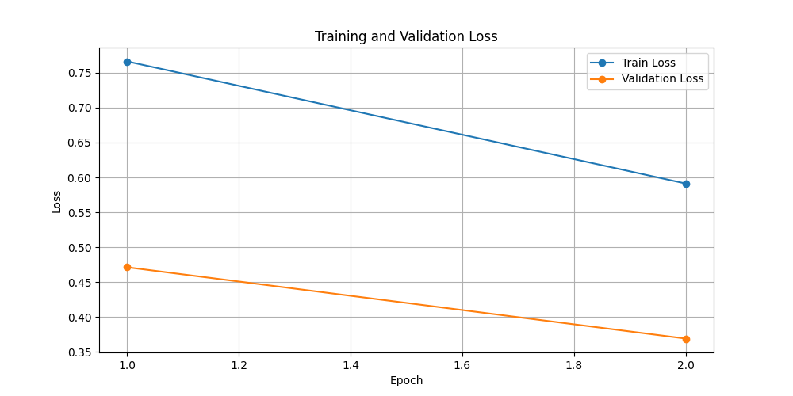
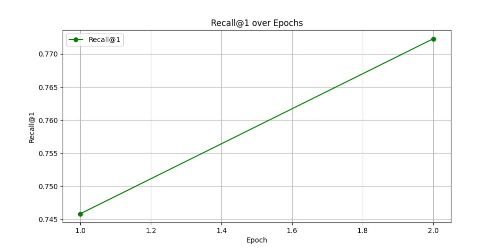
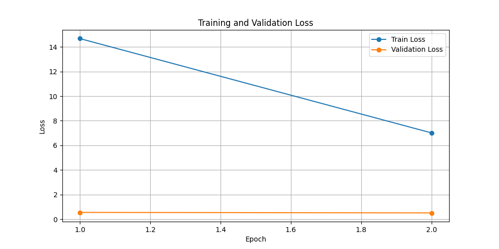
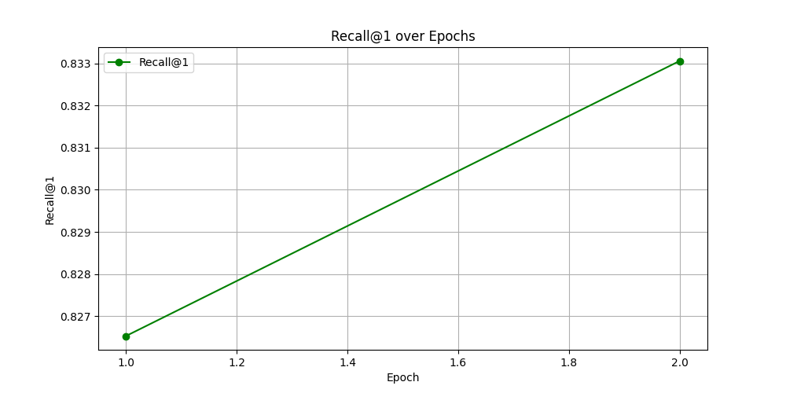
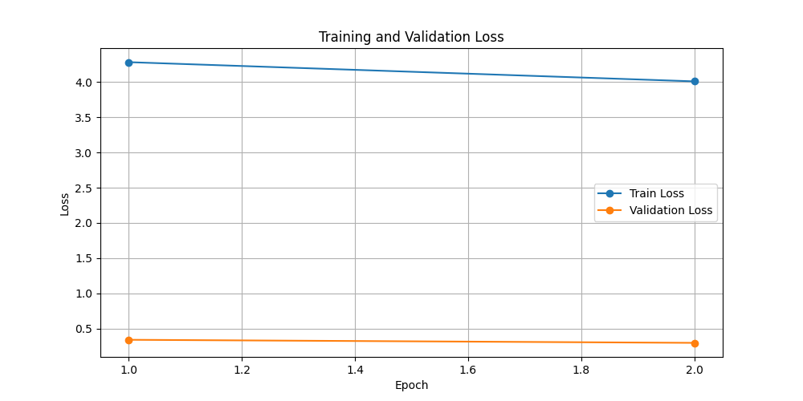
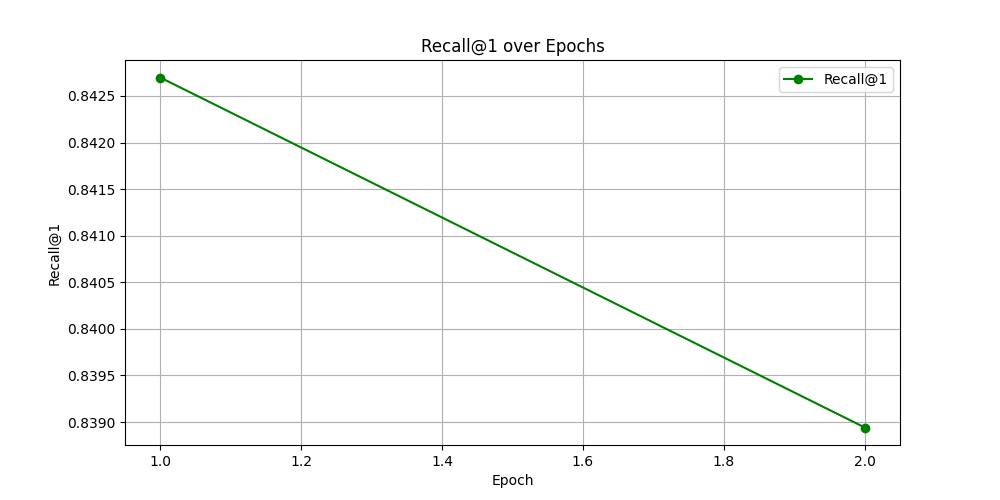

# itmo_cv_course

В этой ветке содержится решение 2-ого ДЗ по курсу CV. Данное ДЗ состоит из нескольких задач:
- Метрика accuracy выше бейзлайна (79.89) + обучение с двумя различными лоссами;
- Дополнительно есть pair-based с более сложной стратегией сэмплирования;
- Дополнительно есть обучение с margin-based лоссом;
- Дополнительно есть обучение с proxy-based лоссом;
- Дополнительно изменен способ построения бейзфайла и инференса (что-то умнее усреднения эмбеддинга и поиска ближайшего). Например, используются методы поиска по полной базе (KNN, FAISS, offline diffusion).

Все задачи успешно решены, исходный код решения предоставлен в скрипте `training_baseline.py`.

Все использованные библиотеки указаны в `requirements.txt`

## Подготовка

Необходимо начать с создания виртуальной среды python и установки библиотек, определенных в `requirements.txt`.

Далее нужно загрузить обучающий датасет. Для выполнения работы необходимо использовать набор caltech256; в оригинальном репозитории для этого используется пакет `fiftyone`, однако по какой-то причине при попытке загрузки возникает ошибка: `eta.core.web.WebSessionError: Unable to get 'https://drive.usercontent.google.com/download?export=download'`. 

После анализа обнаружилось, что ссылка на google drive с датасетом, встроенная в библиотеку, по неизвестной причине перестала работать.
Для решения проблемы необходимо вручную скачать набор (например с [официального сайта](https://data.caltech.edu/records/nyy15-4j048)), распаковать в папке с проектом и/или указать путь в скрипте. При запуске скрипт найдет все изображения, определит метку для каждогт (по префиксу в названии) и разобьет наборы на train/val согласно `val.csv`.

## Структура скрипта

- Реализация `TripletFODataset` и `EmbeddingNet` взяты из оригинального скрипта без изменений;
- Функция `train_one_epoch` переработана и предоставляет на выбор несколько лоссов (`TripletMarginLoss` - минимизирует расстояние между anchor и positive, максимизируя расстояние до negative с заданным margin, `ProxyNCALoss` - оптимизирует эмбеддинги, приближая их к прокси-классам, используя вероятностный подход для разделения классов, и `ArcFaceLoss` - margin-based лосс, вычисляет косинусное расстояние между центроидами классов и текущими изображениями и добаляет к ним зазор margin), а также несколько стратегий сэмплинга позитивов и негативов для TripletMarginLoss (`semi_hard` - Взят из оригинала, выбирает negative эмбеддинги, которые находятся дальше positive, но ближе, чем positive + margin, `batch_hard` - для каждого anchor в батче выбирает наиболее далёкий positive и ближайший negative внутри батча для triplet loss, и `random` - случайно выбирает negative эмбеддинги из батча для triplet loss без дополнительных условий);
- Валидация расширена двумя методами оценки recall@k (помимо оригинальной) - `full`, использует FAISS для поиска k ближайших соседей среди обучающих эмбеддингов для валидационных запросов, и `average`, сравнивает валидационные эмбеддинги с усреднёнными по классам эмбеддингами обучающих данных, присваивая класс ближайшего среднего;
- Функция main дополнена чтением конфиг файла (для удобства трекинга обучения), исправленным методом загрузки данных, а также сохранением графиков лоссов и метрики.

## Эксперименты

В корне проекта находится папка `exps/` с проведенными экспериментами. Каждый из них обучался на протяжении 2-ух эпох с закрепленным batch_size и seed; каждый содержит изображения с графиками лоссов и метрик. Краткое описание:
| Название эксперимента                | Описание                                                                 | Recall@1 |
|-------------------------------------|--------------------------------------------------------------------------|----------|
| triplet_semi_hard_lr1e4_origval     | Triplet loss с semi-hard стратегией, lr=1e-4, валидация по оригинальному алгоритму. Бейзлайн, не достиг заявленной точности (79.89). | 0.7725   |
| triplet_batch_hard_lr5e4_origval    | Triplet loss с batch-hard стратегией, lr=5e-4, валидация по оригинальному алгоритму. | 0.765    |
| triplet_no_strategy_lr5e4_origval   | Triplet loss без дополнительного сэмплирования, lr=5e-4, валидация по оригинальному алгоритму. | 0.37     |
| arcface_lr5e4_origval             | ArcFaceLoss, lr=5e-4, валидация по оригинальному алгоритму.              | 0.8331    |
| arcface_lr5e4_fullval             | ArcFaceLoss, lr=5e-4, валидация при помощи FAISS.                        | 0.7836     |
| arcface_lr5e4_avgval              | ArcFaceLoss, lr=5e-4, валидация по усредненным эмбеддингам обучающих данных. | 0.7764 |
| proxy_nca_lr5e4_origval             | ProxyNCALoss, lr=5e-4, валидация по оригинальному алгоритму.              | 0.825    |
| proxy_nca_lr5e4_fullval             | ProxyNCALoss, lr=5e-4, валидация при помощи FAISS.                        | 0.83     |
| proxy_nca_lr5e4_avgval              | ProxyNCALoss, lr=5e-4, валидация по усредненным эмбеддингам обучающих данных. | **0.839** |

Графики для triplet_semi_hard_lr1e4_origval:
| Losses | Metric |
| --- | --- |
|  |  |

Графики для arcface_lr5e4_origval:
| Losses | Metric |
| --- | --- |
|  |  |

Графики для proxy_nca_lr5e4_avgval:
| Losses | Metric |
| --- | --- |
|  |  |

## Выводы

В данной работе были решены все задачи, проведены эксперименты по обучению эмбеддеров на разных лоссах и стратегиях сэмплинга, имплементированы дополнительные способы построения бейзфайла и инференса. Лучшим решением стала модель `proxy_nca_lr5e4_avgval` с результатом `Recall@1 = 0.839` при оценке по усредненным эмбеддингам обучающих данных